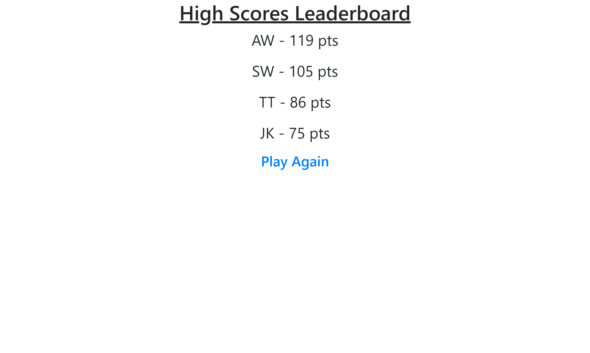

# 🔥 Rapid Fire Quiz Game 🔥

Rules: This quiz game is a race to answer as many questions as you can correctly before time runs out. Your final score is tallied either when all questions are answered or time runs out. Once you answer a question, right or wrong, a new question will appear. If you answer a question wrong, the time will subtract 10 seconds and display a new question. If your score goes below zero before all questions are answered then the quiz will end. The quiz will end once either all questions have been ansered or the timer runs out.

## User Story

In utilizing skills obtained through UNC Bootcamp I am able to build an application that meets the below acceptance criteria. Examples of mock ups showing user interactions is provided as well asshowcasing an understanding of Web APIs and JavaScript. I have also demostrated understainding and skills in  time intervals, attributes, appending elements,and local storage.  

## Acceptance Criteria

GIVEN I am taking a code quiz
WHEN I click the start button
THEN a timer starts and I am presented with a question
WHEN I answer a question
THEN I am presented with another question
WHEN I answer a question incorrectly
THEN time is subtracted from the clock
WHEN all questions are answered or the timer reaches 0
THEN the game is over
WHEN the game is over
THEN I can save my initials and my score
```

## Mock-Up




## Deployment

None

## License
---

© 2023 edX Boot Camps LLC. Confidential and Proprietary. All Rights Reserved.
